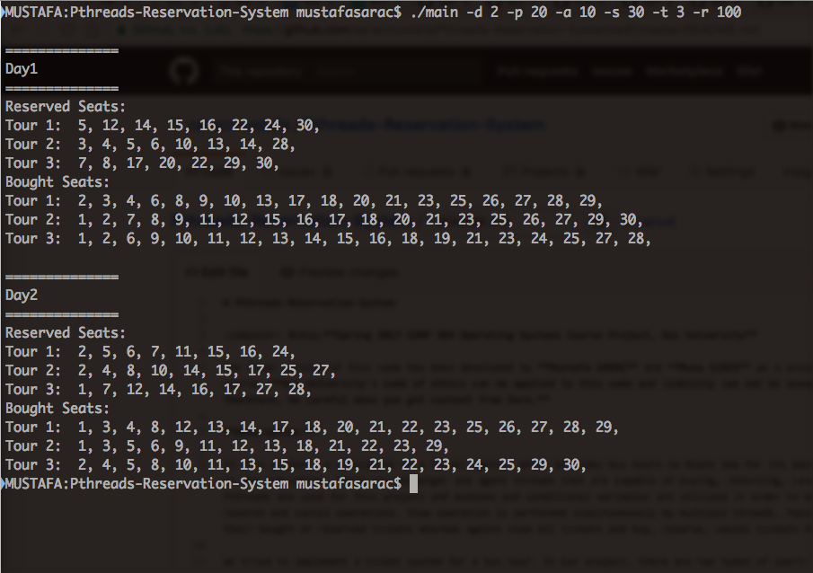

# Pthreads-Reservation-System

:computer: &nbsp;**Spring 2017 COMP 304 Operating Systems Course Project, Koç University**

The final version of this code has been developed by **Mustafa SARAÇ** and **Musa ÇIBIK** as a project of Operating Systems (COMP 304) course. **Koç University's code of ethics can be applied to this code and liability can not be accepted for any negative situation. Therefore, be careful when you get content from here.**

### Description:
This project is a ticket reservation system for a bus tour. There are two types of users: **agents** and **passengers**. 

- **Passengers** can buy or reserve a ticket for themselves, view their reserved or bought ticket, and cancel their reserved or bought ticket.
- **Agents** can do all of these operations for all the customers.

In our design, all passengers and agents are implemented as different threads. They run concurrently and perform the previously explained operations randomly. All seats have **mutex** objects, so that there could be only one passenger or agent thread that can perform operations on the selected seat. The seat that a passenger or an agent will perform operations on is also selected randomly. If the selected operation cannot be run, the operation will not be run by the thread. The simulation is capable of working with multiple tours. 

In addition to these, our program keeps a **log file** for all the operations that successfully executed and it prints the **summary** of the system at the end of each day. You can check given example log file.

In order to test the program, you can compile the **.c file** with gcc compiler and then, execute that **output file** with optional values like in the following simulation photo.

**Properties:**  
**d:** Total simulation time in days  
**p:** Number of Passengers with Unique IDs  
**a:** Number of Agents with Unique IDs  
**s:** Number of Seats with Unique IDs from 1 to S  
**t:** Number of Tours with Unique IDs **(t=1 if not provided)**  
**r:** Value of Random Number Generator Seed.  

### Simulation example with following properties:

**2 Days, 20 Passengers, 10 Agents, 30 Seats Per Tour, 3 Tours, Value of Random Number Generator Seed: 100**

<kbd>
  
</kbd>
 

#### For more detailed questions, you can contact me at this email address: msarac13@ku.edu.tr &nbsp;&nbsp;:email:
